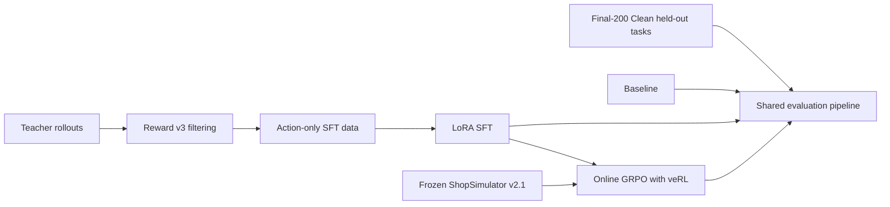
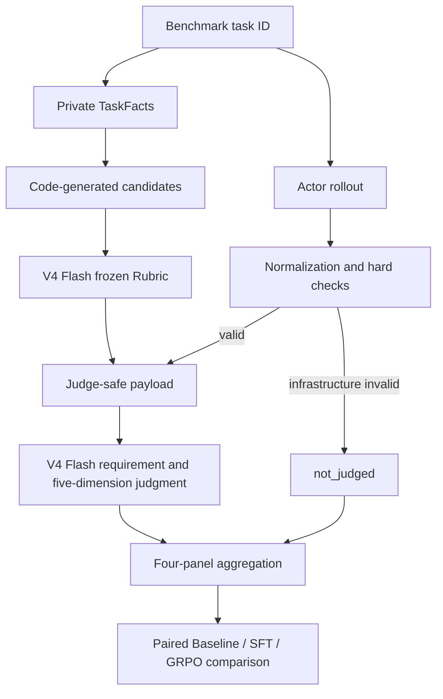

# Shopping GRPO

<div align="center">

**English** · [简体中文](README.md)

<br />

Reproducible post-training and evaluation for long-horizon shopping agents

<br />

[](pyproject.toml)
[](docs/sft.md)
[](https://github.com/verl-project/verl)
[](https://arxiv.org/pdf/2601.18225)
[](docs/evaluation.md#固定-benchmark)

<br />

Teacher rollouts and LoRA SFT → online GRPO with veRL → auditable comparison on
a frozen benchmark

</div>


## What is ShopSimulator?

[ShopSimulator](https://arxiv.org/pdf/2601.18225) is a large-scale Chinese
shopping environment for evaluating long-horizon LLM agents. A task describes
what a user wants—including category, budget, brand, model, functions and
product options—but the agent must discover the right item through interaction.

In this project the agent can search products, open candidates, inspect details,
select variants, buy, or stop when no acceptable item can be verified. Success
therefore requires more than producing a plausible answer: the agent must gather
evidence, obey constraints, choose the correct variant and terminate correctly.

The frozen Environment v2.1 source and product archive are embedded under
[`environments/ShopSimulator/`](environments/ShopSimulator/), so the tutorial
does not depend on a separately running third-party repository.


## The four stages

| Stage | What happens | Entry point | Details |
|---|---|---|---|
| Baseline | Evaluate the untouched base model | `bash scripts/baseline.sh` | [Evaluation](docs/evaluation.md) |
| SFT | Learn tool use from accepted teacher trajectories | `bash scripts/sft.sh` | [SFT](docs/sft.md) |
| GRPO | Optimize terminal Reward v3 with online rollouts | `bash scripts/grpo.sh` | [Training](docs/sft.md#grpo) |
| Evaluation | Run the curated Final-200 Clean protocol | `bash scripts/evaluate.sh NAME` | [Evaluation](docs/evaluation.md) |

The checked-in SFT data was produced by a separate collection stage documented
in [Data collection and training](docs/sft.md). The custom constraint-aware
reward is specified in [Reward v3](docs/reward-v3.md).



### How the SFT data was collected

The current collection used `deepseek-v4-flash` as a teacher in ShopSimulator
Environment v2.1. It produced 2,498 raw trajectories, of which 1,026 passed the
strict acceptance filter. This frozen revision uses 1,000 trajectories split
into 800 training and 200 validation rows. SFT, GRPO and Final-200 Clean task IDs are
pairwise disjoint. Dataset hashes and the audit are in
[Data collection and training](docs/sft.md).

The resumable collection entry point is:

```bash
python scripts/collect_sft_data.py \
  --tasks data/grpo/train.jsonl \
  --output-dir outputs/sft-collection \
  --target-accepted 1000 \
  --workers 4
```

### How GRPO is trained

GRPO starts from the merged SFT model. veRL generates four online trajectories
per prompt in ShopSimulator, while deterministic Reward v3 scores the terminal
purchase, constraint satisfaction and termination behavior. No additional
LLM-as-a-Judge reward model is used for training.

The repository pins `verl==0.8.0` instead of copying its source. It keeps only
the project-specific AgentLoop, tool adapter, runtime compatibility code and a
small SHA-256-checked patch. See the [training guide](docs/sft.md) for details.

### How evaluation works

Formal evaluation combines deterministic checks and a Flash Rubric Curator and
trajectory Judge. The Curator selects directly supported requirements from
code-generated candidates; the same frozen Rubric is shared by Baseline, SFT
and GRPO.

The trajectory Judge sees the Query, frozen Rubric and Actor-visible evidence,
but not Reward values, hidden Gold fields or raw observations.



Flash scores Search Strategy, Candidate Utilization, Evidence Verification,
Decision Quality and Termination Efficiency independently on a 0/1/2 scale. It
also assesses each Rubric and assigns errors from a frozen taxonomy. Reports
keep Reward/terminal, requirement Rubric, trajectory quality and deterministic
behavior separate, with a fixed 200-task denominator.
The [evaluation guide](docs/evaluation.md) documents the pipeline, artifacts
and fixed Final-200 Clean task set.

> **Reserved figure — Training and evaluation pipeline.** A full-width diagram
> showing teacher data collection, LoRA SFT, online GRPO rollouts and the shared
> held-out evaluation path, with artifacts produced at each boundary.

## Results

This repository reproduced the full pipeline on Final-200 Clean
(SHA-256 `d99112a2…`) using two NVIDIA A40 46 GB GPUs:

| Model | Strict success | Purchase success | Done rate | Mean reward | Mean steps |
|---|---:|---:|---:|---:|---:|
| Qwen3.5-2B baseline | 0.50% | 0.50% | 24.0% | -0.1362 | 6.43 |
| LoRA SFT | 62.50% | 62.50% | 99.5% | 0.4979 | 8.86 |
| GRPO step 100 | 63.50% | 63.50% | 100% | 0.5117 | 8.75 |
| GRPO step 500 | 62.50% | 62.50% | 100% | 0.4981 | 8.90 |

These are Final-200 Clean rollout results, not scores from the new Flash Judge.
Their summaries are local `outputs/evaluation/{baseline,sft,grpo-step100,grpo-step500}/summary.json` artifacts.
`experiments/` contains older Benchmark results and does not substantiate this table.

## Training hardware and time

### LoRA SFT training (2× NVIDIA A40 46 GB, 799 train / 200 validation, 3 epochs)

| Item | Value |
|---|---:|
| Launch | `torchrun --standalone --nproc_per_node=2` |
| Effective batch | 1 × 2 GPUs × 8 accumulation = 16 |
| Total steps | 150 (50 steps/epoch) |
| Time per step | 98.8 s |
| Training only / including validation | 4 h 07 min / 4 h 11 min |
| Peak GPU memory | 16.7 GiB |
| train_loss / final eval_loss | 0.3365 / 0.3356 |
| GPU utilization | 59–63% |

18 of the 24 layers are Gated DeltaNet. Fast-kernel dependencies were incomplete
in that run, so it fell back to PyTorch and the GPU was not saturated; with
`flash-linear-attention` installed, the same implementation measured 14.05 s →
2.03 s per step (T=8188, single GPU, forward and backward).

### GRPO training (veRL 0.8, 8 environment workers, 2× NVIDIA A40 46 GB)

| Item | Value |
|---|---:|
| Parallelism | FSDP + DP=2 (one full replica and one vLLM instance per GPU) |
| Time per step | 35–53 s (about 50 s averaged over 500 steps) |
| Full 500 steps | about 10.5 h |
| Training steps / generation batches | 500 / 1989 (281 batches dropped by dynamic sampling) |
| Actor peak GPU memory | 15.7 GiB reserved |

### Other stages

| Stage | Estimated time |
|---|---:|
| Teacher collection (2,498 raw trajectories) | Depends on endpoint concurrency and rate limits |
| Final-200 Clean evaluation (Base) | ~20 min |
| Final-200 Clean evaluation (SFT/GRPO) | ~40–60 min |
| LLM Judge scoring for 200 trajectories | ~30–60 min |

## Requirements

- Linux with an NVIDIA GPU and a compatible CUDA driver;
- [`uv`](https://docs.astral.sh/uv/);
- about 150 GB of free disk for environments, weights and generated artifacts
  (GRPO writes an ~11 GB checkpoint every 50 steps, ~105 GB for 500 steps);
- approximately 48 GB GPU memory for the provided SFT recipe;
- `--liger-kernel` for SFT at 24,576 sequence length (16.7 GiB peak memory);
- two NVIDIA A40 46 GB GPUs for the provided GRPO recipe, measured here
  (`configs/grpo.yaml` is configured accordingly), with 15.7 GiB peak actor memory;
- `RAY_EXPERIMENTAL_NOSET_CUDA_VISIBLE_DEVICES=1` for multi-GPU GRPO; without it
  every rank ends up on GPU0 and NCCL reports `Duplicate GPU detected`;
- `data.dataloader_num_workers=0` when the container `/dev/shm` is below about
  10 GB, otherwise DataLoader workers are OOM-killed.

The main environment uses Python 3.12. ShopSimulator is isolated on Python 3.10.
`uv` creates both environments. veRL is **installed as the pinned
`verl==0.8.0` dependency**; its source is not copied into this repository. Only
the Shopping Agent adapter and a small version-checked patch live here.

## Quick start

Run every command from the repository root.

### 1. Install

```bash
bash scripts/setup.sh
```

This installs the pinned SFT and GRPO dependencies, creates the isolated
ShopSimulator environment, verifies and expands the product archive, builds the
search index and applies the version-checked veRL patch.

### 2. Start ShopSimulator

Keep this terminal running:

```bash
bash scripts/start_environment.sh
```

The service listens on `http://127.0.0.1:5700`.

### 3. Evaluate the baseline

Start the base model server in a second terminal:

```bash
bash scripts/serve_model.sh Qwen/Qwen3.5-2B
```

Evaluate it in a third terminal:

```bash
export OPENAI_BASE_URL=https://your-provider.example/v1
export OPENAI_API_KEY=your-key
bash scripts/baseline.sh
```

`OPENAI_BASE_URL / OPENAI_API_KEY` configure the Flash Curator/Judge;
`LLM_BASE_URL / LLM_API_KEY` configure only the Actor (local vLLM by default).

Stop the model server before training so it releases the GPU.

### 4. Train and evaluate SFT

```bash
bash scripts/sft.sh
bash scripts/serve_model.sh outputs/models/sft-merged
bash scripts/evaluate.sh sft
```

Stop the model server again before GRPO.

### 5. Train GRPO

First inspect the fully resolved launcher without starting CUDA or Ray:

```bash
bash scripts/grpo.sh --dry-run
```

Then train:

```bash
bash scripts/grpo.sh
```

Choose a checkpoint using validation metrics and export its actor:

```bash
bash scripts/export_grpo.sh \
  outputs/models/grpo/global_step_100/actor \
  outputs/models/grpo-merged
```

Evaluate it:

```bash
bash scripts/serve_model.sh outputs/models/grpo-merged
bash scripts/evaluate.sh grpo
```

Generated checkpoints, rollouts and logs are written under `outputs/`, which is
ignored by Git.

## Reward V3 overview

Reward v3 is a deterministic terminal reward; it does not rely on another
language model for subjective judgment:

- category and budget are hard gates;
- brand, model, core functions and key options use weights of
  `0.35 / 0.25 / 0.25 / 0.15`;
- an exact target purchase with full satisfaction receives `1.0`;
- a fully satisfying alternative item receives `0.55`;
- partial satisfaction receives a continuous score capped at `0.25`;
- wrong purchases, premature abstention, repeat loops and maximum-step
  termination receive distinct negative rewards;
- insufficient evidence sets `reward_valid=false`, rather than being treated as
  a valid neutral zero.


The complete formula, termination rules and evidence requirements are in the
[Reward v3 design guide](docs/reward-v3.md).

## Repository map

```text
configs/                         current GRPO, AgentLoop and tool configuration
data/
  sft/                           800 train + 200 validation trajectories
  grpo/                          ready-to-train JSONL and veRL Parquet
  evaluation/                    curated Final-200 Clean held-out set
docs/                            one guide for each tutorial stage and Reward v3
environments/ShopSimulator/      embedded environment and product archive
experiments/
  baseline/                      baseline config and result summary
  sft/                           SFT config and result summary
  grpo/                          GRPO config and result summary
scripts/                         thin user-facing tutorial entry points
src/shopping_grpo/
  collection/                    Teacher acceptance and SFT data construction
  environment/                   HTTP client, tools, actions and observations
  training/sft/                  SFT dataset masking and collation
  training/grpo/                 veRL adapter, compatibility and sampling logic
  evaluation/                    hard checks, Rubrics, trajectory Judge and metrics
tests/                           focused unit, launcher and packaging checks
```

The project keeps focused checks for the CPU smoke path, offline trajectory
evaluation, GRPO launcher arguments, non-editable wheel installation, Reward
aggregation and the frozen environment manifest. Cleanup does not mean deleting
tests that protect the public workflow.

## Configuration

Most users only need these environment variables:

| Variable | Default |
|---|---|
| `BASE_MODEL` | `Qwen/Qwen3.5-2B` |
| `SHOPSIM_BASE_URL` | `http://127.0.0.1:5700` |
| `LLM_BASE_URL` | `http://127.0.0.1:8000/v1` |
| `SERVED_MODEL_NAME` | `shopping-agent` |
| `SFT_ADAPTER_DIR` | `outputs/models/sft-lora` |
| `SFT_MERGED_DIR` | `outputs/models/sft-merged` |

Advanced GRPO overrides can be appended after `--`:

```bash
bash scripts/grpo.sh -- \
  trainer.total_training_steps=20 \
  trainer.save_freq=10
```

SwanLab logging is opt-in:

```bash
export SWANLAB_API_KEY=...
bash scripts/grpo.sh --logger swanlab
```

## Documentation

- [Data collection, SFT and GRPO](docs/sft.md)
- [Final-200 Clean evaluation](docs/evaluation.md)
- [Reward v3](docs/reward-v3.md)

## Future improvement plan

To further improve planning, tool use, and constraint satisfaction on long-horizon shopping tasks, the project will pursue the following directions:

- **Scale up the model**: Train a larger `Qwen3.5-9B` model on top of the current experiments and evaluate how model scale affects long-horizon stability and end-task success rate.
- **Upgrade the Teacher models and trajectory collection**: Move beyond a single Teacher model by using a mixture of `Qwen3.8 Flash`, `GLM-5.3-Flash`, and `DeepSeek-V4-Flash-0731` to collect trajectories, improving the coverage, behavioral diversity, and quality ceiling of the training data.
- **Expand the independent validation set**: Increase the number and variety of validation tasks to cover more product categories, constraint combinations, and interaction paths, strengthening the statistical reliability and generalization assessment of the results.
- **Introduce finer-grained credit assignment**: Address sparse terminal rewards and the difficulty of distinguishing individual action contributions in long-horizon interactions by providing more effective training signals for important intermediate steps.

## References and acknowledgements

This tutorial builds on the
[ShopSimulator paper](https://arxiv.org/pdf/2601.18225) and source project,
[veRL](https://github.com/verl-project/verl), and
[Qwen](https://github.com/QwenLM/Qwen3).

The evaluation protocol and Benchmark construction were also informed by
[VitaBench: Benchmarking LLM Agents with Versatile Interactive Tasks in Real-world Applications](https://arxiv.org/pdf/2509.26490)
and
[EComAgentBench: Benchmarking Shopping Agents on Long-Horizon Tasks with Distributed Hidden Intent](https://arxiv.org/pdf/2606.17698).

The repository organization and tutorial presentation were informed by
[qiqihezh/agentic-grpo-longhorizon](https://github.com/qiqihezh/agentic-grpo-longhorizon).
Thanks to the [OpenCode Go plan](https://dev.opencode.ai/go) for supporting the
development workflow.

### Contributors

<a href="https://github.com/Guochangwei917">
  
</a>
