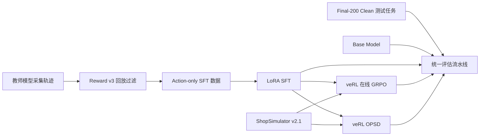
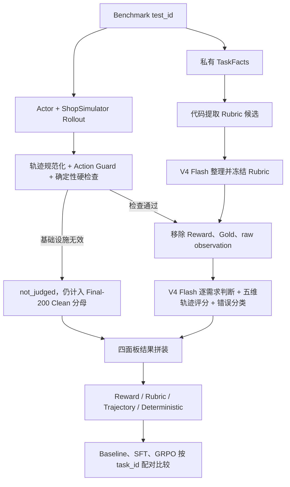

# Shopping GRPO

<div align="center">

<br />

面向长程购物 Agent 的可复现后训练与评测项目

<br />

[](pyproject.toml)
[](docs/training.md)
[](https://github.com/verl-project/verl)
[](https://arxiv.org/pdf/2601.18225)
[](docs/evaluation.md#固定-benchmark)

<br />

教师轨迹与 LoRA SFT → veRL GRPO / OPSD → Final-200 Clean Benchmark 的可审计对比

</div>


## ShopSimulator 是什么？

[ShopSimulator](https://arxiv.org/pdf/2601.18225) 是一个用于评估长程购物
Agent 的大规模中文购物环境。每个任务会给出一段用户需求，其中可能包含商品类别、
预算、品牌、型号、核心功能以及颜色、尺寸、容量、套餐等具体规格。

Agent 不能只生成一句“推荐购买某商品”，而是必须真正与环境交互：

1. 根据需求搜索商品；
2. 打开并比较候选商品；
3. 查看描述、参数和可选规格；
4. 选择正确的商品变体；
5. 购买满足约束的商品，或者在证据充分时合理终止。

这类任务同时考察指令理解、工具调用、长上下文管理、约束满足和终止决策。项目内嵌
了冻结的 ShopSimulator Environment v2.1 源码和商品数据，位于
[`environments/ShopSimulator/`](environments/ShopSimulator/)，不需要用户再单独
克隆或修改一份环境仓库。


## 项目做了什么？

项目按照一条连续的后训练流水线组织：



| 阶段 | 目标 | 入口 | 详细文档 |
|---|---|---|---|
| Baseline | 测量原始 Qwen3.5-2B 的工具使用能力 | `bash scripts/baseline.sh` | [评估](docs/evaluation.md) |
| SFT | 从高质量教师轨迹学习合法、完整的购物行为 | `bash scripts/sft.sh` | [SFT](docs/training.md#sft) |
| GRPO | 在真实环境 Rollout 中优化 Reward v3 | `bash scripts/grpo.sh` | [训练](docs/training.md#grpo) |
| OPSD | 私有商品参考指导冻结教师，对学生动作逐 token 自蒸馏，不使用任务奖励 | `bash scripts/opsd.sh` | [OPSD](docs/training.md#opsd) |
| Evaluation | 使用同一批 Final-200 Clean 留出任务公平比较模型 | `bash scripts/evaluate.sh NAME` | [评估](docs/evaluation.md) |

### SFT 数据是怎么收集的？

当前数据使用 `deepseek-v4-flash` 作为教师模型，在 ShopSimulator
Environment v2.1 中采集：

- 共获得 2,498 条原始任务轨迹；
- 每条轨迹在采集时都真实执行环境动作，再按 Reward v3 终局结果验收；
- 其中 1,026 条通过严格验收，本次固定使用 1,000 条；
- 最终划分为 800 条训练数据和 200 条验证数据，并与 GRPO、Final-200 Clean
  保持 task_id 零重叠。

仓库已提供可断点续跑的采集入口：

```bash
python scripts/collect_sft_data.py \
  --tasks data/grpo/train.jsonl \
  --output-dir outputs/sft-collection \
  --target-accepted 1000 \
  --workers 4
```

SFT 只在 Assistant 动作 token 上计算 Loss，用户指令和环境 Observation 会被
Mask。这样模型学习的是可执行的工具策略，而不是背诵环境返回内容。数据哈希、接受率
和采集审计见[采集与训练指南](docs/training.md)。

### GRPO 是怎么训练的？

GRPO 从合并后的 SFT 模型开始。veRL 在 ShopSimulator 中为每个 Prompt 在线生成
四条轨迹，环境用确定性的 Reward v3 评估最终购买结果、约束满足程度和终止行为。
训练不使用额外的 LLM-as-a-Judge Reward Model。

本仓库没有复制 veRL 源码，而是固定安装 `verl==0.8.0`，并保留项目自己的
AgentLoop、工具适配层、运行时兼容代码和一个带 SHA-256 校验的小补丁。详细配置见
[采集与训练指南](docs/training.md)。

### 评估流水线是怎么设计的？

**默认评估只运行 Actor rollout、确定性指标和 HTML 报告，不调用 Rubric Curator 或轨迹 Judge。**
只有明确需要语义诊断时，才用 `EVAL_RUBRIC_JUDGE=1 bash scripts/evaluate.sh NAME` 开启下述额外流程。
DeepSeek V4 Flash 从代码候选中选择 Query 明确表达的约束，再对 Actor 可见轨迹评分；
不提供 Reward 分数、Gold 私有字段或 raw observation，结果按 schema 和真实 event_id 校验。
这里的 Rubric 是逐任务评分标准，不是向量检索式 RAG。



以 Final-200 中的 `task_id=8187` 为例，Query 要求“一对卡通-永结同心款的高档
酒红色木梳、礼盒、陪嫁、20 元左右”。代码生成 7 条候选，V4 Flash 冻结为 5 条
Rubric；SFT Actor 用 10 步完成搜索、详情核验、规格选择和购买。Flash 对轨迹评分，
并为每项结论引用真实的 `event_id`。

Flash 看不到 Reward 分数、Gold 商品私有字段、raw Observation、成功标签或其他模型
结果，因此不能根据答案倒推轨迹质量。最终结果分为四个独立面板：

1. Environment Reward 与终局；
2. Query Rubric 的 hard/soft 满足情况和 Reward disagreement；
3. Flash Judge 五维分布与错误类型；
4. 步数、工具、Guard、重复、上下文和基础设施指标。

四部分不会合成一个总分。缺失、报错和 `not_judged` 任务仍保留在 Final-200 Clean 分母中。
Prompt、输入隔离、产物与 Final-200 Clean 筛选口径见
[评估指南](docs/evaluation.md)。


## 实验结果

下表为 Final-200 Clean 的 200 题 rollout 结果；GRPO、OPSD 使用已验证加载的 LoRA adapter。

| 模型 | 严格成功率 | 购买成功率 | 完成终局率 | 平均 Reward | 平均步数 |
|---|---:|---:|---:|---:|---:|
| Qwen3.5-2B Baseline | 0.50% | 0.50% | 24.0% | -0.1362 | 6.43 |
| LoRA SFT | 62.50% | 62.50% | 99.5% | 0.4979 | 8.86 |
| GRPO step 100 | 62.50% | 62.50% | 99.5% | 0.5088 | 9.03 |
| GRPO step 500 | 69.50% | 69.50% | 98.0% | 0.6136 | 9.45 |
| OPSD step 200 | 69.00% | 69.00% | 98.0% | 0.5961 | 8.04 |

结果摘要位于 `outputs/evaluation/{baseline,sft,grpo-step100-lora-final200,grpo-step500-lora-final200}/summary.json`。
OPSD 当前版本结果位于 `outputs/evaluation/opsd-b8-v3-retry2-step200-rerun/summary.json`（138/200）。

## 训练硬件与耗时

### SFT LoRA 训练（2× NVIDIA A40 46 GB，799 条训练 / 200 条验证，3 个 epoch）

| 项 | 值 |
|---|---:|
| 启动方式 | `torchrun --standalone --nproc_per_node=2` |
| 有效 batch | 1 × 2 卡 × 8 累积 = 16 |
| 总步数 | 150（50 步/epoch） |
| 单步耗时 | 98.8 秒 |
| 训练本体 / 含验证总时长 | 4 小时 07 分 / 4 小时 11 分 |
| 峰值显存 | 16.7 GiB |
| train_loss / 最终 eval_loss | 0.3365 / 0.3356 |
| GPU 利用率 | 59–63% |

24 层中 18 层为 Gated DeltaNet，本次运行快速内核依赖未装齐，走 PyTorch fallback，
GPU 未满载。装齐 `flash-linear-attention` 后同一实现实测单步 14.05 s → 2.03 s
（T=8188，单卡，前反向）。

### GRPO 训练（veRL 0.8，8 个环境 worker，2× NVIDIA A40 46 GB）

| 项 | 值 |
|---|---:|
| 并行方式 | FSDP + DP=2（每卡一个完整副本与一个 vLLM 实例） |
| 单步耗时 | 35–53 秒（500 步均值约 50 秒） |
| 完整 500 步 | 约 10.5 小时 |
| 训练步 / 生成批次 | 500 / 1989（281 批被动态采样丢弃） |
| actor 峰值显存 | 15.7 GiB reserved |

### 其他环节

| 环节 | 耗时估算 |
|---|---:|
| Teacher 采集（2,498 条原始轨迹） | 取决于接口并发与限流 |
| 200 任务评测（Base） | ~20 分钟 |
| 200 任务评测（SFT/GRPO） | ~40–60 分钟 |
| LLM Judge 评分 200 条轨迹 | ~30–60 分钟 |

## 环境要求

- Linux；
- NVIDIA GPU 和兼容的 CUDA Driver；
- [`uv`](https://docs.astral.sh/uv/)；
- 大约 150 GB 可用磁盘空间，用于依赖、模型权重和运行产物（GRPO 每 50 步一个约
  11 GB 的 checkpoint，完整 500 步约 105 GB）；
- SFT 在 24,576 序列长度下需要 `--liger-kernel`，峰值显存 16.7 GiB；
- GRPO 在双卡 A40 46 GB 上实测通过（`configs/grpo.yaml` 已按要求配置），actor 峰值显存 15.7 GiB；
- 多卡 GRPO 需要 `RAY_EXPERIMENTAL_NOSET_CUDA_VISIBLE_DEVICES=1`，否则所有 rank 都会跑到
  GPU0 上，并触发 NCCL `Duplicate GPU detected`；
- 容器 `/dev/shm` 小于约 10 GB 时，`data.dataloader_num_workers` 必须为 0，否则 DataLoader
  worker 会被 OOM kill。

主训练环境使用 Python 3.12，ShopSimulator 使用隔离的 Python 3.10 环境。
`scripts/setup.sh` 会通过 `uv` 创建并安装两套环境。

## 快速开始

以下命令都在仓库根目录执行。

### 1. 安装

```bash
bash scripts/setup.sh
```

该脚本会安装固定版本的 SFT、veRL 和 vLLM 依赖，创建独立的 ShopSimulator
环境，校验并解压商品数据，构建搜索索引，并应用经过版本和哈希检查的 veRL 补丁。

### 2. 启动 ShopSimulator

在第一个终端运行并保持服务：

```bash
bash scripts/start_environment.sh
```

服务默认监听 `http://127.0.0.1:5700`。

### 3. 运行 Baseline

在第二个终端启动基础模型：

```bash
bash scripts/serve_model.sh Qwen/Qwen3.5-2B
```

在第三个终端评估：

```bash
bash scripts/baseline.sh
```

`LLM_BASE_URL / LLM_API_KEY` 配置 Actor（默认本地 vLLM）；运行配置见[评估文档](docs/evaluation.md)。默认评估不需要 Flash 凭据。
仅显式开启 `EVAL_RUBRIC_JUDGE=1` 时，另设 `OPENAI_BASE_URL / OPENAI_API_KEY` 配置 Flash Curator/Judge。

开始训练前请停止模型服务，释放 GPU 显存。

### 4. 训练并评估 SFT

```bash
bash scripts/sft.sh
bash scripts/serve_model.sh outputs/models/sft-merged
bash scripts/evaluate.sh sft
```

完成评估后再次停止模型服务。

### 5. 训练 GRPO

先只解析并打印最终命令，不启动 CUDA 或 Ray：

```bash
bash scripts/grpo.sh --dry-run
```

开始训练：

```bash
bash scripts/grpo.sh
```

根据验证集指标选择 Checkpoint，并导出 veRL Actor：

```bash
bash scripts/export_grpo.sh \
  outputs/models/grpo/global_step_100/actor \
  outputs/models/grpo-merged
```

启动并评估导出的模型：

```bash
bash scripts/serve_model.sh outputs/models/grpo-merged
bash scripts/evaluate.sh grpo
```

`serve_model.sh` 检测到 `lora_adapter/` 时，将其注册为 `shopping-agent` 并作为评估请求的模型；
未应用 LoRA 的基座另列为 `shopping-agent-base`。启动后先从 `/v1/models` 核对两者。

每次 `evaluate.sh` 完成后会自动生成 `outputs/evaluation/grpo/report.html`。对已有评测结果补生成报告：

```bash
bash scripts/report.sh grpo
```

批量生成所有单模型报告和综合比较报告：

```bash
bash scripts/report_all.sh
```

报告生成器按评测目录读取 `summary.json` 和 `trajectories.jsonl`，模型名与评测参数会从结果中自动填入，因此换模型或换评测标签不需要修改报告代码。

Checkpoint、Rollout 和日志统一写入 Git 忽略的 `outputs/`。

### 6. 训练 OPSD

学生自行 rollout，冻结教师额外读取商品参考，逐 token 蒸馏，不使用任务奖励。
使用全部 1,000 个训练任务；actor、teacher 各一张 GPU，启动前停止评测服务。

```bash
bash scripts/opsd.sh -- \
  data.train_batch_size=8 trainer.total_training_steps=200 trainer.save_freq=50
```

参考设计与运行细节见[OPSD 文档](docs/training.md#opsd)。

## Reward v3 简介

Reward v3 是一个确定性的终局 Reward，不依赖另一个大模型进行主观判断：

- 类别和预算是 Hard Gate；
- 品牌、型号、核心功能、关键规格按照 `0.35 / 0.25 / 0.25 / 0.15` 加权；
- 完全满足并命中目标商品得到 `1.0`；
- 完全满足的替代商品得到 `0.55`；
- 部分满足按照连续分数计算，最高 `0.25`；
- 错误购买、过早放弃、重复循环和达到最大步数都会获得不同负奖励；
- 证据不足时标记为 `reward_valid=false`，不会伪装成有效的零分样本。


完整公式、终止条件和证据要求见 [Reward v3 设计文档](docs/reward-v3.md)。

## 仓库结构

```text
configs/                         当前 GRPO、AgentLoop 和工具配置
data/
  sft/                           800 条训练 + 200 条验证轨迹
  grpo/                          JSONL 与 veRL Parquet 数据
  evaluation/                    Final-200 Clean 留出任务
docs/                            数据、SFT、GRPO、评估与 Reward 文档
environments/ShopSimulator/      内嵌环境源码和商品数据
experiments/
  baseline/                      Baseline 配置与结果
  sft/                           SFT 配置与结果
  grpo/                          GRPO 配置与结果
scripts/                         面向用户的薄入口脚本
src/shopping_grpo/
  collection/                    Teacher 轨迹验收与 SFT 数据构造
  environment/                   环境客户端、动作、工具和 Observation
  training/sft/                  SFT 数据渲染与 Mask
  training/grpo/                 veRL AgentLoop、适配和动态采样
  evaluation/                    硬检查、Rubric、轨迹 Judge 和指标汇总
tests/                           核心单元、入口和 Wheel 安装检查
```

## 常用配置

| 环境变量 | 默认值 |
|---|---|
| `BASE_MODEL` | `Qwen/Qwen3.5-2B` |
| `SHOPSIM_BASE_URL` | `http://127.0.0.1:5700` |
| `LLM_BASE_URL` | `http://127.0.0.1:8000/v1` |
| `SERVED_MODEL_NAME` | `shopping-agent` |
| `SFT_ADAPTER_DIR` | `outputs/models/sft-lora` |
| `SFT_MERGED_DIR` | `outputs/models/sft-merged` |

GRPO 的高级 Hydra 参数可以追加在 `--` 后：

```bash
bash scripts/grpo.sh -- \
  trainer.total_training_steps=20 \
  trainer.save_freq=10
```

SwanLab 默认关闭，需要时显式启用：

```bash
export SWANLAB_API_KEY=...
bash scripts/grpo.sh --logger swanlab
```

## 文档导航

- [数据采集、SFT、GRPO 与 OPSD](docs/training.md)
- [Final-200 Clean 评估](docs/evaluation.md)
- [Reward v3](docs/reward-v3.md)

## 后续改进计划

为进一步提升模型在长程购物任务中的规划、工具调用与约束满足能力，后续将从以下几个方面推进项目：

- **扩大模型规模**：在现有实验基础上，训练更大规模的 `Qwen3.5-9B` 模型，评估模型规模对长程任务稳定性和最终成功率的影响。
- **升级 Teacher 模型与轨迹采集方案**：不再依赖单一 Teacher 模型，计划采用 `Qwen3.8 Flash`、`GLM-5.3-Flash` 和 `DeepSeek-V4-Flash-0731` 的混合方案进行轨迹收集，以提升训练数据的覆盖范围、行为多样性与质量上限。
- **扩大独立验证集**：增加验证任务数量和任务类型，覆盖更多商品类别、约束组合与交互路径，从而提高实验结论的统计可靠性和泛化评估能力。
- **引入更细粒度的信用分配**：针对长程交互中终局奖励稀疏、动作贡献难以区分的问题，采用更细粒度的信用分配方法，为关键中间步骤提供更有效的训练信号。

## Star History

<a href="https://www.star-history.com/?repos=YYHDBL%2Fshopping-grpo-longhorizon&type=date&legend=top-left">
 <picture>
   <source media="(prefers-color-scheme: dark)" srcset="https://api.star-history.com/chart?repos=YYHDBL/shopping-grpo-longhorizon&type=date&theme=dark&legend=top-left&sealed_token=wgQ1K2TiIB2luvZFJ54oMEhME-cxYmFv_wNoNXnT7lMZHsuQUy7NThQAG2VwpEeiUBoRxd09ASiB60cvvBaEvqVqyv49wYKZSF2H_Jft3Iq1ZZ0c5Sk2SQQejxHxMQwayMTRroOh5JhcWgXk6w8HHwjP6UgTquINRr40c7XysMi_j2BksVwqOWSIz8Ny" />
   <source media="(prefers-color-scheme: light)" srcset="https://api.star-history.com/chart?repos=YYHDBL/shopping-grpo-longhorizon&type=date&legend=top-left&sealed_token=wgQ1K2TiIB2luvZFJ54oMEhME-cxYmFv_wNoNXnT7lMZHsuQUy7NThQAG2VwpEeiUBoRxd09ASiB60cvvBaEvqVqyv49wYKZSF2H_Jft3Iq1ZZ0c5Sk2SQQejxHxMQwayMTRroOh5JhcWgXk6w8HHwjP6UgTquINRr40c7XysMi_j2BksVwqOWSIz8Ny" />
   
 </picture>
</a>

## 引用与致谢

本项目建立在
[ShopSimulator 论文](https://arxiv.org/pdf/2601.18225)及其开源环境、
[veRL](https://github.com/verl-project/verl) 和
[Qwen](https://github.com/QwenLM/Qwen3) 之上。

评测协议和 Benchmark 构建还参考了
[VitaBench: Benchmarking LLM Agents with Versatile Interactive Tasks in Real-world Applications](https://arxiv.org/pdf/2509.26490)
以及
[EComAgentBench: Benchmarking Shopping Agents on Long-Horizon Tasks with Distributed Hidden Intent](https://arxiv.org/pdf/2606.17698)。

仓库结构和教程呈现参考了
[qiqihezh/agentic-grpo-longhorizon](https://github.com/qiqihezh/agentic-grpo-longhorizon)。
感谢 [OpenCode Go 套餐](https://dev.opencode.ai/go) 对开发工作的支持。

### Contributors

<a href="https://github.com/Guochangwei917">
  
</a>
